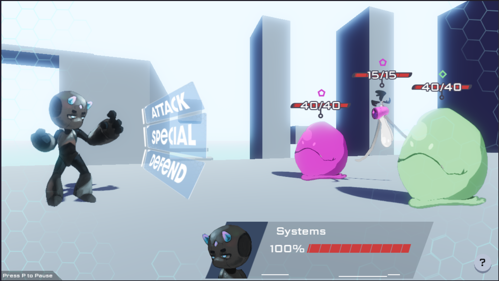
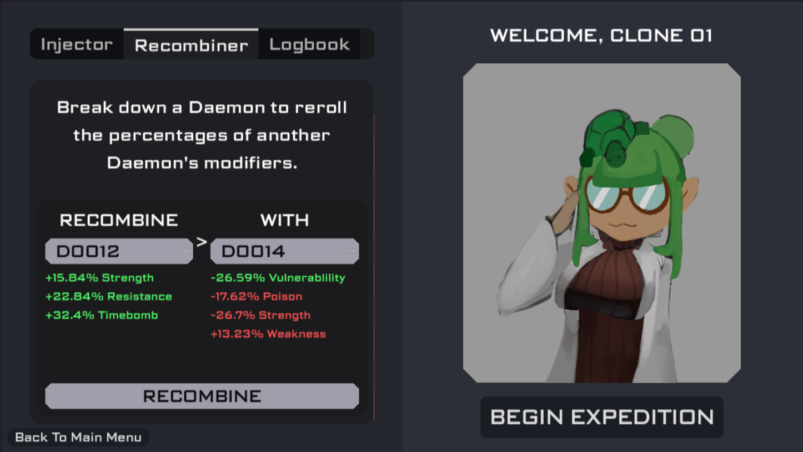
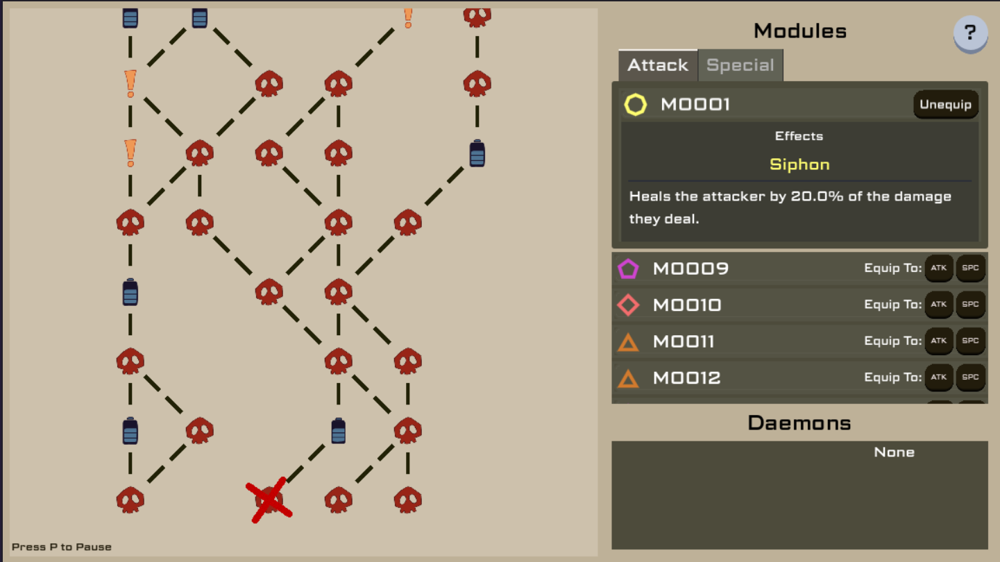

# Operation: Daemon
A roguelite with a dash of meta-progression and story, made in 9 days for the [94th Godot Wild Jam](https://itch.io/jam/godot-wild-jam-94).

Play on web or download builds from the [itch page](https://programmeroncoffee.itch.io/operation-daemon).

## Gameloop
The upgrades in the game are called Modules and Daemons;
- Modules are arrays of Effects, which do different things during combat (Poison, Resistance, etc) - these are equipped to the player's Attack and Special.
- Daemons are arrays of Modifiers, which apply percent changes to Effects (+10% Poison, etc)

Enemies spawn with a certain number of Modules & Daemons depending on the act;
- When the player is hit by an Enemy, the game begins 'researching' that Enemy's Daemons; every hit is +5% research, and at the end of every combat encounter the Daemons being researched have a chance to get discoved based on their research (ie, 5 hits -> 25% research -> 25% chance to get discovered every combat). Once discovered, they can be equipped / recombined in the Laboratory
- At the end of combat encounters, the Enemies' Modules are used to create the loot Modules the player can take. 

After every run, the player is sent back to the Laboratory, where they can do things with discovered daemons before starting a new run;
- Equip them, to get their Modifiers applied to any Modules they loot during their next run (with a max of 5 Daemons equipped at once)
- Recombine them, deleting one Daemon to reroll the Modifier percentages of another. This is used to try and get better Daemons, since they're just as likely to have negative Modifiers as positive ones.

Combat itself is turned-based, where the player gets two attacks, and each enemy gets a random weighted number of attacks depending on the act.
- Every attack the player makes, they get prompted to hit a quick-time-event to actually do the damage, otherwise they miss.
- Every attack the enemies make, the player gets a QTE to parry the attack, and take less damage. By using the Defend option, the player can make this a Counter instead, where the damage gets partially reflected onto the attacker.

## Credits

2D Art: <a href="https://kyveri.carrd.co/" target="_blank">Kyveri</a>

Composing: <a href="https://www.myokami.it/" target="_blank">Myokami</a>

Sound Effects: <a href="https://jewelzaudioworks.carrd.co/" target="_blank">Jewelz AudioWorks</a>

Programming: <a href="https://baton-0.itch.io/" target="_blank">Baton</a> and <a href="https://programmeroncoffee.github.io/" target="_blank">ProgrammerOnCoffee</a>

Created for the 94th Godot Wild Jam.
